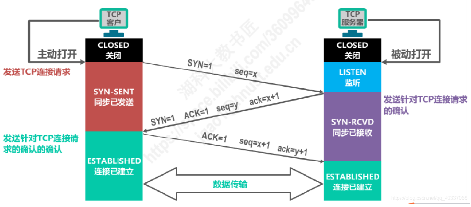

# 计算机网络基础

## TCP 三次握手
#### 简介
TCP三次握手是浏览器和服务器建立连接的方式，目的是为了使二者能够建立连接，便于后续的数据交互传输。

#### 流程
- 一次握手：客户端发送带有 SYN 标志的连接请求数据包给服务端, 请求连接
- 二次握手：服务端发送带有 SYN+ACK 标志的连接请求和应答数据包给客户端, 表示确认并可以连接了
- 三次握手：客户端发送带有 ACK 标志的应答数据包给服务端(可以携带数据了), 表示收到确认并建立连接

#### DDOS 原理
当多台客户端向服务器发送请求时，利用三次握手的原理，在第二次握手服务器回应请求之后，客户端不发送回应，即不进行第三次握手，直到服务器超时。  
当客户端过多能把服务器占满时，所有客户端都不进行第三次握手的话，服务器无法为其他客户端提供服务，无法和正常的客户端进行第二次握手，也就导致了网络崩溃的状态。

