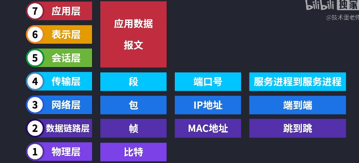
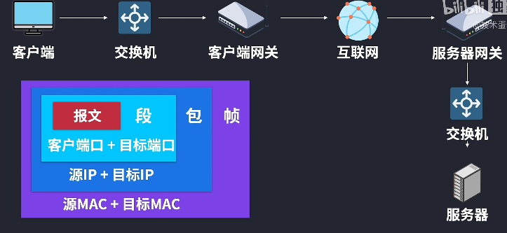

# 计算机网络基础
解决网络间的主机通信问题

## OSI 七层模型

#### 物理层
发送 bit 数据通过不同的媒介传输出去
#### 数据链路层
bit 被封装成帧， 加上 mac 地址
#### 网络层
通过 ip 地址寻址, 将分组从源端传送到目的端
包+客户端mac+目标mac， 被封装成帧
#### 传输层
管理两个节点之前的数据传输， 
段+ 源IP + 目标IP， 被封装成包
TCP UDP 协议
#### 会话层
管理控制登录状态， 同步服务  
报文 + 源端口 + 目的端口， 封装成段
建立、维护、管理会话连接
#### 表示层
不同计算机的表示方式可能不同, 编码和解码，压缩
格式化数据，加密，解密
#### 应用层
本层的数据， 又称为报文  
为应用程序提供网络服务

## TCP 三次握手
#### 简介
TCP三次握手是浏览器和服务器建立连接的方式，目的是为了使二者能够建立连接，便于后续的数据交互传输。

#### 流程
- 一次握手：客户端发送带有 SYN 标志的连接请求数据包给服务端, 请求连接
- 二次握手：服务端发送带有 SYN+ACK 标志的连接请求和应答数据包给客户端, 表示确认并可以连接了
- 三次握手：客户端发送带有 ACK 标志的应答数据包给服务端(可以携带数据了), 表示收到确认并建立连接

#### DDOS 原理
当多台客户端向服务器发送请求时，利用三次握手的原理，在第二次握手服务器回应请求之后，客户端不发送回应，即不进行第三次握手，直到服务器超时。  
当客户端过多能把服务器占满时，所有客户端都不进行第三次握手的话，服务器无法为其他客户端提供服务，无法和正常的客户端进行第二次握手，也就导致了网络崩溃的状态。

