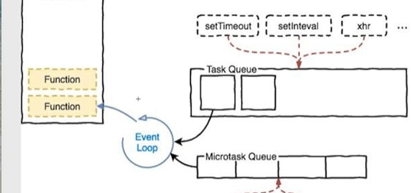

# JavaScript 基础

## 宏任务与微任务
#### 背景
JS 是单线程的. 由于JS 的主要用途是与用户交互并且操作 DOM， 多线程会带来不必要的麻烦.  
在 JS 中,有同步任务和异步任务,异步任务会进入事件循环,并且先执行同步任务,再执行异步任务.

#### 事件循环
数据请求, 定时器, 事件 等任务会进入事件循环,等待被执行.  
在事件循环中, 包含宏任务和微任务.  
要执行宏任务之前需要先执行微任务

#### 宏任务
```JS
promise.then
process.nextTick()
async/await
```
#### 微任务
```JS
setTimeOut
setInterval
IO 操作
事件
UI 渲染
数据请求
```

#### 执行顺序
同步任务 -> 事件循环(异步任务) -> 微任务 -> 宏任务


